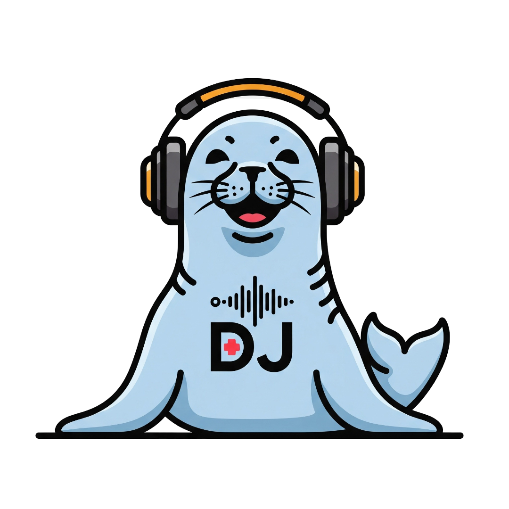

# Robby the Robb - DJ APP 🎧🦭

Robby the Robb - DJ APP 🎧🦭
Beschreibung

Robby the Robb - DJ APP ist eine voll funktionsfähige, webbasierte DJ-Performance-Software. Sie kombiniert klassische DJ-Tools mit modernen Features wie einer MIDI-Integration, KI-Unterstützung und jetzt auch einem kompletten Benutzer-System mit personalisierten Einstellungen.

Mixe, synchronisiere und scratche wie ein Profi – alles direkt im Browser!
Features
DJ-Funktionen

    Zwei Decks mit detaillierter Waveform-Visualisierung und Beatgrid

    Mixer mit 3-Band-EQ, Filter & Crossfader

    Hot Cues und Loop-Controls pro Deck

    Automatische BPM-Analyse und Metadaten-Erkennung beim Track-Upload

    MIDI-Controller-Support (Mappings für Traktor S4 MK3 & Pioneer DDJ-400 vordefiniert)

    Keyboard-Shortcuts für alle wichtigen Funktionen

    KI-basierte DJ-Tipps via Google Gemini API

NEU: Benutzer- und Personalisierungs-Features

    Benutzer-Authentifizierung: Sichere Registrierung und Login für jeden DJ.

    Persistente Einstellungen: Deine Mixer- und MIDI-Mapping-Einstellungen werden automatisch in deinem Profil gespeichert und beim nächsten Login geladen.

    Passwort-Reset: "Passwort vergessen"-Funktion mit E-Mail-Verifizierung.

    Willkommens-E-Mail: Schicke, HTML-formatierte Willkommens-Mail nach der Registrierung.

Architektur

Die Anwendung besteht aus zwei Hauptteilen:

    Frontend: Eine Single-Page-Application, gebaut mit React und TypeScript. Sie ist für die gesamte Benutzeroberfläche und die DJ-Logik im Browser zuständig.

    Backend: Ein Server auf Basis von Node.js und Express. Er dient als API, verwaltet die Benutzerlogik und kommuniziert mit der Datenbank.

    Datenbank: Eine MySQL-Datenbank, in der alle Benutzerdaten (Profile, Passwörter als Hash) und die persönlichen Einstellungen sicher gespeichert werden.

Installation & Setup

Um die Anwendung lokal zu starten, befolge diese Schritte:
1. Voraussetzungen

    Node.js (Version 16 oder höher)

    Ein laufender [verdächtiger Link entfernt]

2. Repository klonen

git clone [https://gitlab.robbstock-entertainment.de/Block/robby-the-robb-dj-app.git](https://gitlab.robbstock-entertainment.de/Block/robby-the-robb-dj-app.git)
cd robby-the-robb-dj-app

3. Backend konfigurieren

a. Abhängigkeiten installieren:

cd backend
npm install

b. Umgebungsvariablen einrichten:
Erstelle im backend-Ordner eine Datei namens .env und fülle sie mit deinen Daten. Eine Vorlage findest du in der server.js oder hier:

# MySQL Datenbank
DB_HOST=localhost
DB_USER=dein_mysql_benutzer
DB_PASSWORD=dein_mysql_passwort
DB_NAME=dj_app_db

# E-Mail SMTP (z.B. für IONOS)
SMTP_HOST=smtp.ionos.de
SMTP_PORT=587
SMTP_USER=deine_email@deinedomain.de
SMTP_PASS=dein_email_passwort
EMAIL_FROM="Robby the Robb DJ APP <deine_email@deinedomain.de>"

# JWT Secret
JWT_SECRET=ein_sehr_geheimes_passwort_fuer_tokens

c. Datenbank-Tabellen erstellen:
Führe die SQL-Befehle aus den *.sql-Dateien im Projekt aus oder verwende die Befehle aus den Canvas-Dokumenten, um die users- und user_settings-Tabellen zu erstellen.
4. Frontend konfigurieren

a. Abhängigkeiten installieren:

# Gehe zurück ins Hauptverzeichnis, falls du noch im backend-Ordner bist
cd .. 
npm install

b. API-Schlüssel (Optional):
Wenn du die KI-Tipps nutzen möchtest, erstelle eine .env-Datei im Hauptverzeichnis und füge deinen Google Gemini API-Schlüssel hinzu:

API_KEY=dein_google_gemini_api_schluessel

5. Anwendung starten

Du benötigst zwei geöffnete Terminals:

    Backend starten:

    # Im /backend Verzeichnis
    npm start 
    # oder: node server.js

    Frontend starten:

    # Im Hauptverzeichnis
    npm run dev

Öffne anschließend die URL, die im Frontend-Terminal angezeigt wird (z.B. http://localhost:5173).
Kontakt

Fragen, Wünsche oder Feedback?
Schick 'ne Mail an: support@robbstock-entertainment.de