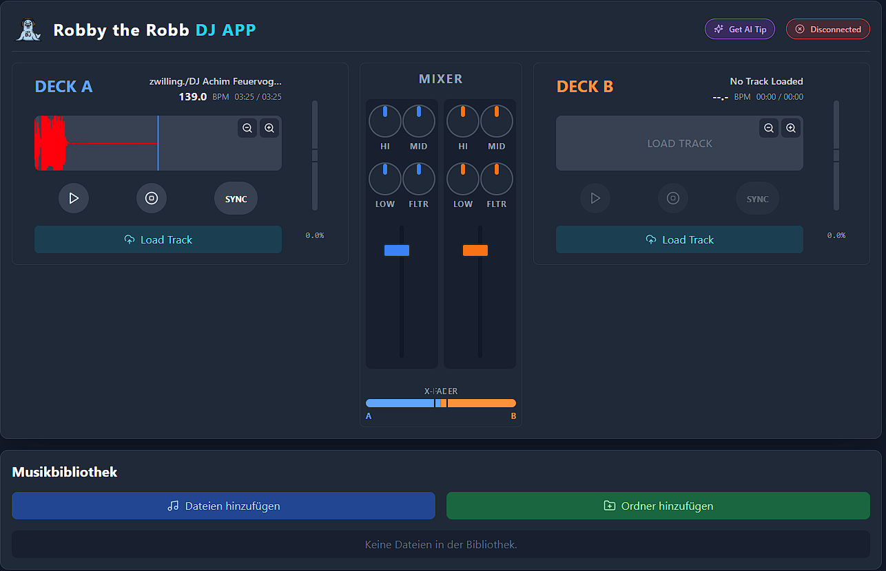

# Robby the Robb - DJ APP 🎧🦭


## Beschreibung

**Robby the Robb - DJ APP** ist deine coole, webbasierte DJ-Performance-Software mit MIDI-Integration für Traktor Kontrol S4 MK3.  
Mix, sync und scratche wie ein Pro – alles im Browser mit fetten Visuals und smarter AI-Unterstützung!

---

## Features

- Zwei Decks mit Waveform-Visualisierung  
- Mixer mit EQ, Filter & Crossfader  
- MIDI Controller Support (Traktor Kontrol S4 MK3 Mapping)  
- KI-basierte DJ-Tipps via Google Gemini API  
- Musikbibliothek mit Drag & Drop & Ordnerimport  
- BPM Analyse & Beatgrid-Erkennung  

---

## Demo Screenshots

<div style="display: flex; gap: 15px; flex-wrap: wrap; justify-content: center;">
  
  
</div>

---

## Installation

1. Klone das Repository:

   ```bash
   git clone https://gitlab.robbstock-entertainment.de/Block/robby-the-robb-dj-app.git
   cd robby-the-robb-dj-app

    Installiere die Abhängigkeiten:

npm install

Starte die Entwicklungsversion:

    npm run dev

Nutzung

    Musik laden via Drag & Drop oder über den Button.

    MIDI Controller verbinden und loslegen (speziell für Traktor Kontrol S4 MK3).

    KI-Tipps für freshe Mixideen abrufen.

    Crossfader, EQ & Filter regeln, um den perfekten Sound zu kreieren.

Lizenz

MIT License © DJ Robbstock
Kontakt

Fragen, Wünsche oder Feedback?
Schick 'ne Mail an: support@robbstock-entertainment.de
Git Setup (kurz)

    Repo erstellen (GitLab):

        Gehe zu GitLab Repository

    Lokal initialisieren und verbinden:

git init
git add .
git commit -m "Initial commit: Robby the Robb DJ APP"
git branch -M main
git remote add origin https://gitlab.robbstock-entertainment.de/Block/robby-the-robb-dj-app.git
git push -u origin main

Von nun an:

    git add .
    git commit -m "Message"
    git push

Bilderquellen

    Robby the Robb Logo: Eigenes Design

    App Screenshot: Eigene Entwicklung

Enjoy und viel Spaß beim Robben! 🦭🎶

